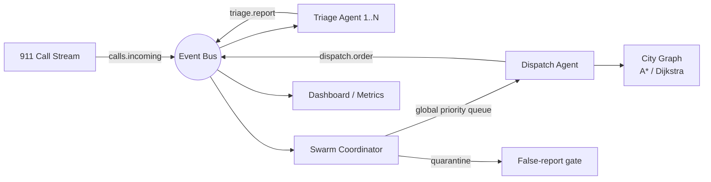

# Smart City Dynamic Dispatch Grid

A multi-agent AI swarm for disaster-time emergency dispatch: it ingests a high-volume stream of noisy 911 transcripts, triages and deduplicates them into incidents, prioritizes by lives at risk, and dispatches scarce resources over a live city road graph with dynamic re-routing and preemption.

## Run the website (full stack)

The web app runs the real Python engine server-side and streams every tick to the
browser over WebSocket. Completed runs are saved to SQLite and get a permanent
shareable URL (`/runs/<id>`).

```
pip install -r requirements.txt
cd web && npm install && npm run build && cd ..
uvicorn server.app:app --port 8000
# open http://localhost:8000 — configure a disaster, watch the swarm live
```

Frontend development with hot reload: `cd web && npm run dev` (proxies `/api`
to the uvicorn server on port 8000).

| Piece | Where |
|---|---|
| FastAPI app (REST + WebSocket + static serving) | `server/app.py` |
| Tick-stepping engine wrapper w/ unit interpolation | `server/engine.py` |
| SQLite run store | `server/db.py` |
| React + Vite + Tailwind frontend | `web/src/` |

## Run headless (CLI)

```
python -m dispatch_grid.main --duration 3600 --incidents 320
open dashboard.html        # legacy self-contained in-browser demo
```

---

## 1. System architecture

```
                        ┌──────────────────────────────────────────────────┐
                        │                 EVENT BUS (pub/sub)              │
   911 call stream      │  topics: calls.incoming · triage.report ·       │
  ───────────────────▶  │  incident.created/updated/resolved ·            │
   (1000+ transcripts)  │  dispatch.order · resource.status               │
                        └───────┬───────────────┬───────────────┬─────────┘
                                │               │               │
                  ┌─────────────▼──┐    ┌───────▼────────┐  ┌───▼───────────────┐
                  │ TRIAGE SWARM   │    │ SWARM          │  │ DISPATCH AGENT(S) │
                  │ (N stateless   │    │ COORDINATOR    │  │                   │
                  │  agents,       │    │ · global       │  │ · resource DB     │
                  │  round-robin   │───▶│   incident     │─▶│ · route planner   │
                  │  sharded)      │    │   priority     │  │   (A*/Dijkstra)   │
                  │ · extraction   │    │   queue        │  │ · allocation +    │
                  │ · dedup score  │    │ · conflict     │  │   preemption      │
                  │ · confidence   │    │   resolution   │  │ · unit lifecycle  │
                  └────────────────┘    │ · false-report │  └───┬───────────────┘
                                        │   quarantine   │      │
                                        └───────┬────────┘      │
                                                │               ▼
                                        ┌───────▼────────┐  ┌──────────────────┐
                                        │  METRICS /     │  │ CITY GRAPH       │
                                        │  DASHBOARD     │  │ nodes=intersect. │
                                        │  snapshots     │  │ edges=roads      │
                                        └────────────────┘  │ weights=time ×   │
                                                            │ congestion,      │
                                                            │ closures         │
                                                            └──────────────────┘
```

Mermaid version:



## 2. Agent interaction workflow

1. **Ingest** — a raw `EmergencyCall` is published on `calls.incoming`.
2. **Triage** — the coordinator shards the call round-robin to one of N stateless Triage Agents. The agent extracts location (fuzzy gazetteer match), incident type (keyword lattice), severity 1–5, affected people, urgency (0.5–2.0 from language cues like "trapped", "screaming"), required resources, and a confidence score, then publishes a `TriageReport`.
3. **Gate** — reports with confidence below 0.42 and no corroborating active incident enter a 7-minute quarantine. If a second independent report corroborates them, they're admitted; otherwise they expire as probable false reports. This is how hedged calls ("my friend told me, not sure?") are suppressed without ignoring real emergencies.
4. **Dedup & merge** — the coordinator scores the report against every active incident: 0.45 × location match + 0.30 × type match + 0.25 × time proximity (decaying over a 15-minute window). Above 0.62 the report merges: severity takes the max, conflicting people-counts blend 60/40 toward the corroborated value, missing locations fill in, and confidence rises with corroboration. Below it, a new `Incident` is created. Note that two simultaneous fires at the same landmark are intentionally indistinguishable — merging them is the correct call until field units report back.
5. **Prioritize** — the global queue orders pending incidents by
   `Priority = Severity × LivesAtRiskFactor × Urgency × Aging × Corroboration`,
   where `LivesAtRiskFactor = 1 + √people` (diminishing returns), `Aging` grows to 2× after 10 minutes waiting (anti-starvation), and `Corroboration` rewards multiply-reported incidents.
6. **Dispatch** — for each incident in priority order the Dispatch Agent attempts an *atomic* allocation: every required unit type must be sourceable or nothing is sent (partial fills waste scarce units). It picks the cheapest units by routed travel time + fuel penalty, keeps a 12% coverage reserve of each fleet at home stations for fresh incidents, and may *preempt* en-route units whose current incident's priority is less than 1/2.2 of the new one.
7. **Execute** — units move along their A* routes; every tick the router checks remaining edges against new closures/congestion and re-routes if blocked or >40% slower. Arrival → on-scene work (severity-scaled) → resolution → return to station → refuel if below 30%.
8. **Learn/report** — every state change is published back on the bus; the coordinator emits dashboard snapshots (active incidents, backlog, utilization, average response time, estimated lives saved).

## 3. Data schemas

```jsonc
// EmergencyCall (input)
{ "call_id": "CALL00042", "transcript": "Please help! huge fyre near Central Mall! ppl traped!",
  "received_at": 812.0 }

// TriageReport (Triage Agent → bus)
{ "call_id": "CALL00042", "location": "Central Mall", "node": 66,
  "incident_type": "Fire", "severity": 5, "affected_people": 30,
  "resources_needed": {"FireTruck": 2, "Ambulance": 2},
  "urgency": 1.75, "confidence": 0.81, "received_at": 812.0 }

// Incident (coordinator's global store)
{ "incident_id": "INC0007", "incident_type": "Fire", "location": "Central Mall",
  "node": 66, "severity": 5, "affected_people": 30, "urgency": 1.75,
  "resources_needed": {"FireTruck": 2, "Ambulance": 2},
  "first_reported": 812.0, "last_reported": 1040.0, "report_count": 6,
  "status": "dispatched", "confidence": 0.97,
  "assigned_units": ["FireTruck_3", "FireTruck_7", "Ambulance_2"] }

// DispatchOrder (Dispatch Agent → bus)
{ "incident_id": "INC0007",
  "assigned_resources": ["FireTruck_3", "FireTruck_7", "Ambulance_2"],
  "eta": "4.0 minutes", "routes": {"FireTruck_3": [60, 61, 62, 66]},
  "preempted_from": null }

// Unit (resource DB row)
{ "unit_id": "Ambulance_2", "unit_type": "Ambulance", "home_node": 71,
  "node": 64, "status": "en_route", "fuel": 0.76,
  "assigned_incident": "INC0007", "eta": 1052.0 }
```

## 4. Event-driven architecture

The in-process `EventBus` is a stand-in with a 1:1 topic mapping to a production broker (Kafka/NATS):

| Topic | Producer | Consumers | Production partitioning |
|---|---|---|---|
| `calls.incoming` | telephony/ASR gateway | triage swarm | partition by call hash |
| `triage.report` | triage agents | coordinator | partition by location geohash |
| `incident.*` | coordinator | dashboard, dispatch, audit log | keyed by incident_id |
| `dispatch.order` | dispatch agents | field units (MDT), dashboard | keyed by unit_id |
| `resource.status` | unit telemetry | dispatch agents | keyed by unit_id |

Design properties: all agent state transitions are bus events (full audit trail and replay), triage agents are stateless and horizontally scalable, and the coordinator is the single writer for incident records, which eliminates write conflicts between agents by construction. Conflict resolution that remains — two triage shards reporting the same event milliseconds apart — collapses in the coordinator's dedup pass; two dispatchers claiming one unit cannot occur because unit ownership is also single-writer per region.

## 5. Code map

| File | Contents |
|---|---|
| `dispatch_grid/models.py` | All dataclasses/enums (schemas above) |
| `dispatch_grid/callgen.py` | 1000+ noisy call generator: duplicates, typos, panic, conflicting counts, multi-incident calls, false reports, beta-distributed escalation |
| `dispatch_grid/triage.py` | Agent 1: extraction, fuzzy gazetteer, dedup scoring, merge logic |
| `dispatch_grid/routing.py` | City graph, Dijkstra, A*, congestion, closures, dynamic re-routing |
| `dispatch_grid/dispatch.py` | Agent 2: resource DB, atomic allocation, coverage reserve, preemption, unit lifecycle (en-route → on-scene → returning → refuel) |
| `dispatch_grid/coordinator.py` | Swarm coordinator: event bus, quarantine gate, global priority queue, metrics |
| `dispatch_grid/simulation.py` | Event loop, disruption injection, console dashboard, timeline export |
| `dispatch_grid/llm_triage.py` | LLM-backed Triage Agent (same `extract()` contract; batched structured-output calls; falls back to rules on API failure) |
| `dispatch_grid/evaluation.py` | Evaluation harness: field-level extraction scoring vs labeled ground truth + end-to-end system comparison |
| `dashboard.html` | Self-contained live web dashboard (runs the swarm in-browser) |
| `triage_eval.html` | Browser eval app: runs the real LLM-vs-rules comparison with no API key setup |

## 6. Fault tolerance & robustness

- **No-location calls** are admitted but held un-routable; if a later duplicate carries a location, the merge fills it in and the incident immediately becomes dispatchable.
- **Unreachable incidents** (closures isolate a node): dispatch returns `None`, the incident stays queued, aging raises its priority, and re-routing retries every tick as roads change.
- **Atomic multi-resource dispatch** prevents deadlock-by-partial-allocation when fleets run dry.
- **Quarantine + corroboration** bounds the damage of false reports to zero dispatched units while guaranteeing real incidents reported twice always get through.
- **Coordinator crash** (production): incident state is a deterministic fold over the event log — replay rebuilds it; a hot standby tails the same topics.
- **Triage agent crash**: stateless; the call is redelivered to another shard (at-least-once delivery + idempotent dedup makes duplicates harmless — dedup *is* the idempotency layer).

## 7. Scalability for city-wide deployment

- **Geographic sharding.** Partition the city into cells (geohash level ~6). Each cell gets a coordinator + dispatch agent owning its incidents and home-stationed units. Cross-cell mutual aid is an explicit `resource.request` message between coordinators — the same preemption math, one level up.
- **Triage scale-out.** Extraction is embarrassingly parallel: scale ASR + LLM triage pods on queue depth. The output contract (`TriageReport`) is the only coupling, so the rule-based extractor here swaps for an LLM with zero changes downstream.
- **Dedup at scale.** Replace the linear scan with (a) geohash + type bucketing so candidates are O(local incidents), and (b) an embedding index (FAISS/pgvector) for semantic similarity on transcripts; the scoring weights stay identical.
- **Routing at scale.** Precompute contraction hierarchies for the static graph (queries in microseconds city-wide); apply live closures/congestion as a thin dynamic overlay, falling back to A* only on affected corridors.
- **State.** Incident store → Postgres with the event log in Kafka (compacted topics); unit telemetry → Redis for sub-second availability reads.
- **Numbers.** One coordinator shard comfortably handles ~50 events/sec; a city at disaster peak (10k calls/hour ≈ 3/sec) is a single-digit-shard problem — the sharding exists for fault isolation and locality more than raw throughput.
- **Human-in-the-loop.** Every auto-dispatch above a configurable severity emits a `dispatch.proposed` event a human dispatcher can veto within an SLA window; on timeout it commits. During total overload the veto window shrinks to zero — graceful degradation from assistive to autonomous.

## 8. Simulation results (seed 42)

1,003 calls over 60 minutes → 68 merged incidents (918 duplicates merged, 24 low-confidence reports quarantined), 51 dispatch orders, 9 preemptions, 44 resolved within the run window, average response time ≈ 11.3 minutes under 14 road closures and 30 congestion waves, with hazmat and rescue-boat fleets fully saturated mid-disaster.

## 9. LLM triage & evaluation

The rule-based extractor is now one of two interchangeable triage backends. `LLMTriageAgent`
(`llm_triage.py`) implements the identical `extract(call) -> TriageReport` contract by sending
batched transcripts to Claude with a structured-output prompt that grounds locations against the
gazetteer (hallucinated locations are rejected and nulled), then validates and clamps every field
before constructing the report. On any API error, timeout, or malformed response it falls back to
the deterministic extractor per batch, so triage quality degrades instead of dispatch halting.

The evaluation harness (`evaluation.py`) scores any extractor on the generator's labeled ground
truth at two levels. Field level: incident-type accuracy, location accuracy (correct landmark, or
correctly null when the caller gave none), severity MAE and within-±1 rate, median relative error
on casualty counts, and false-report discrimination measured as Mann-Whitney AUC over the
confidence scores plus catch/loss rates at the coordinator's 0.42 quarantine gate. System level
(`--system`): the full swarm runs once per extractor on the same seed, comparing dedup compression,
backlog, response time and lives saved — extraction errors only matter insofar as they change
dispatch outcomes, and this measures exactly that.

Baseline (seed 42, 201 calls): the rules score 73.4% type accuracy, 92.6% location accuracy,
severity MAE 1.21, false-report AUC 0.984 with 100% caught at the gate at the cost of 6.4% of
real calls quarantined. Run the comparison yourself:

```
ANTHROPIC_API_KEY=... python -m dispatch_grid.evaluation --llm --n 200 --system
```

or open `triage_eval.html`, which runs the same comparison in the browser with no key setup and
shows per-call detail of where each extractor succeeded or failed.
